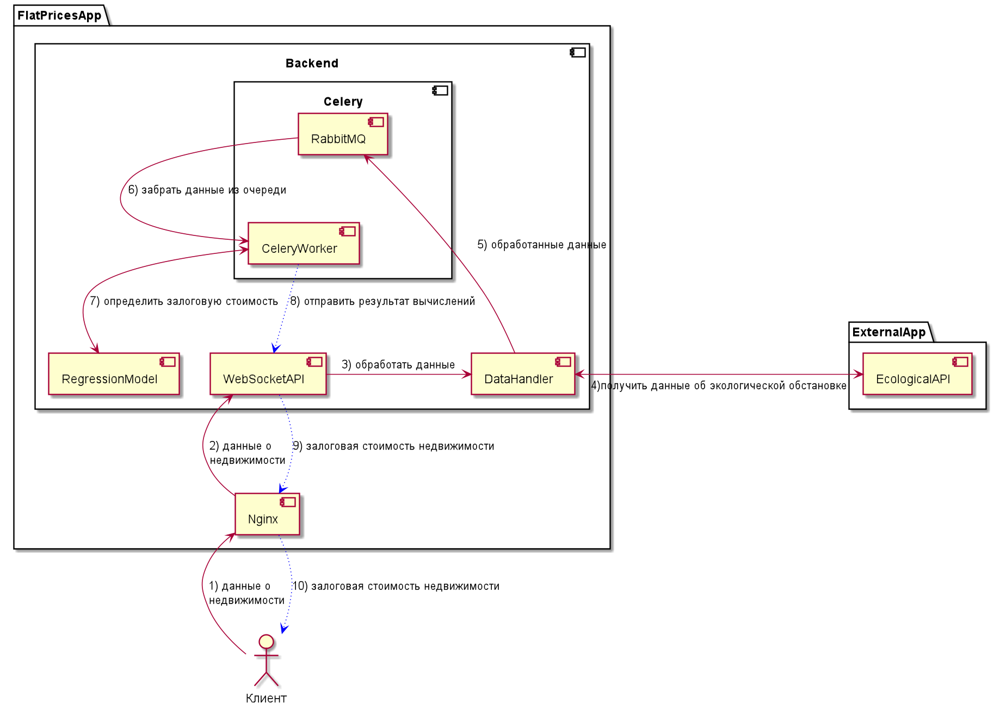

# Описание структуры системы
Приложение состоит из несколькиз микросервисов, которые запущены в Docker контейнерах. 
Взаимодействие между контейнерами происходит с помощью docker-compose.

В качестве прокси-сервера используется NGINX. 
За клиентскую часть отвечает Vue приложение (на схеме указано как Клиент).

# Запуск приложения
Для запуска перейдите в основную директорию репозитория `FlatPrices_Vahta`.
Из командной строки выполните
- `docker-compose build` 
- `docker-compose up` (с флагом `-d` для запуска в фоновом режиме)
Примерно в течение 3 минут все сервисы будут запущены и данные загружены.
Для проверки работы приложения перейдите на http://127.0.0.1:8080

