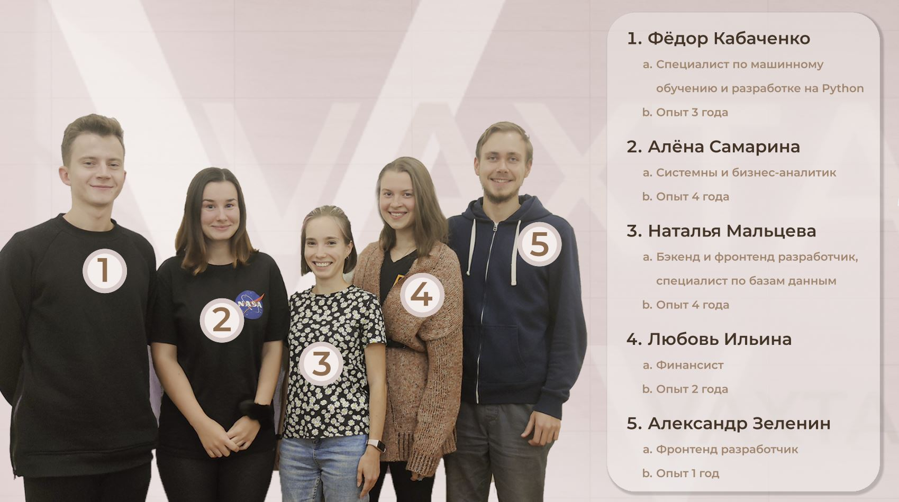

# DEMO 

#Репозиторий
https://github.com/MaltsevaNata/FlatPrices_Vahta

# Описание структуры системы
Приложение состоит из несколькиз микросервисов, которые запущены в Docker контейнерах. 
Взаимодействие между контейнерами происходит с помощью docker-compose.

В качестве прокси-сервера используется NGINX. 
За клиентскую часть отвечает Vue приложение (на схеме указано как Клиент).

# Запуск приложения
Скачайте или склонируйте репозиторий.
Перед запуском приложения для корректной работы установите в репозиторий `FlatPrices_Vahta/backend/predict_models`
модели машинного обучения, которые лежат на гугл-диске: https://drive.google.com/drive/folders/1ZUVWch7loWwpBMV27dRwrJ99sGbMdEsU?usp=sharing
Для запуска перейдите в основную директорию репозитория `FlatPrices_Vahta`.
Из командной строки выполните
- `docker-compose build` 
- `docker-compose up` (с флагом `-d` для запуска в фоновом режиме)
Примерно в течение минуты все сервисы будут запущены и готовы к работе.
Для проверки работы приложения перейдите на http://127.0.0.1:8080

# ВАЖНО:
Сейчас приложение поддерживает только 1 клиента. 

# КОМАНДА
